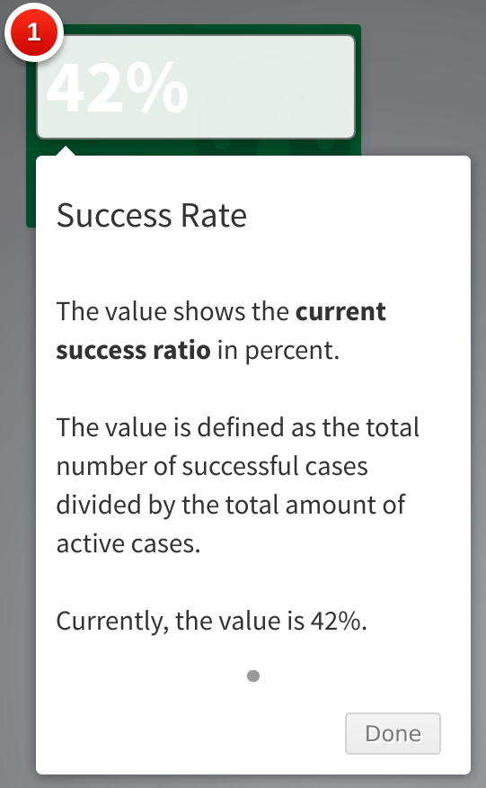

```{css, echo=FALSE}
a {
  color: #dd4814;
}
.remark-inline-code {
  color: #dd4814;
}
.remark-code {
  font-size: 10px;
}
.smaller {
  font-size: 10px;
}
.small {
  font-size: 12px;
}
```


```{r setup, include=FALSE}
knitr::opts_chunk$set(echo = TRUE)
```

# What is `rintrojs`?

.pull-left[
- A wrapper for `intro.js`, which allows to create

> step-by-step guides and feature introductions

- Easy to use in `shiny` applications
]

--

.center[
```{r, echo=FALSE, out.width="30%"}

```
]

---
class: inverse, middle, center

# Example 1
See also `simple-app.R` at<br>[github.com/davzim/talks/2020-10-20-boston-user-rintrojs/examples/simple-app.R](https://github.com/DavZim/talks/blob/main/2020-10-20-boston-user-rintrojs/examples/simple-app.R)

---
# Why use `rintrojs`?

What are the benefits of using guides and tooltips?

- Helps your users to understand the application, reduces hurdles and frictions
- Shows the users the intended workflow
- Highlights certain areas / new features
- Shows definitions and can act as user facing documentation, e.g., variable definitions in tables

.center[
```{r, echo=FALSE}
DiagrammeR::grViz("digraph {
  graph [layout = dot, rankdir = LR]
  
  node [shape = rectangle]        
  rec1 [label = '1) Reduces hurdles and easier to understand']
  rec2 [label = '2) Happy user']
  rec3 [label = '3) More usage & acceptance']
  rec4 [label = '4) More projects?!']
  
  # edge definitions with the node IDs
  rec1 -> rec2 -> rec3 -> rec4
  }", height = 100, width = 700)
```
]

---
# Technology

.pull-left[
## `intro.js`

JavaScript library which provides the guides/tooltip functionality

Created by [Afshin Mehrabani](https://afshinm.name/) and [Benjamin J DeLong](https://bozdoz.com/) + [Community](https://github.com/usablica/intro.js/graphs/contributors)

Lives here: https://introjs.com/

License: AGPL v3.0 & Commercial License
]

.pull-right[
## `rintrojs`

R package which acts as a wrapper around `intro.js`

Created by [Carl Ganz](https://github.com/carlganz) + [Community](https://github.com/carlganz/rintrojs/graphs/contributors)

Lives here: https://carlganz.github.io/rintrojs/

License: AGPL v3.0
]

.smaller[
If the AGPL / commercial license is not for you, have a look at John Coene's [`cicerone`](https://github.com/JohnCoene/cicerone) (based on [`driver.js`](https://kamranahmed.info/driver.js/), both MIT licensed) as an alternative to `rintrojs`.
]

---
# Basic Usage

Multiple ways to create a guide

- write it directly in HTML tags (`intro.js` way)

```html
<!--- Include introjs.js and introjs.css somewhere --->
<h1 data-step="1" data-intro="This is a tooltip!">Basic Usage</h1>
```

--

- use `rintrojs` and wrap elements with `introBox()`

```{r, eval=FALSE}
# In the UI of the shiny app
introBox(
  actionButton("btn", "Button"),
  data.step = 1,
  data.intro = "This is a button"
)
```

--

- Define a `data.frame` containing references to HTML elements and the tour information. 
Start the tour depending on an event.

```{r, eval=FALSE}
# somewhere in the app
step_df <- data.frame(...)

# in server
observeEvent(input$startTour, {
   introjs(session, options = list(steps = step_df))
})
````


---
# Basic Example based on `data.frame`

.pull-left[
Basic `shiny` application
```{r, eval=FALSE}
library(shiny)


ui <- fluidPage(
  
  actionButton("startTour", "Start the Tour"),
  ...
)


server <- function(input, output, session) {
  ...
  
  
  
}

shinyApp(ui, server)
```
]

--

.pull-right[
Application with `rintrojs` tour
```{r, eval = FALSE}
library(shiny)
library(rintrojs) #<<

step_df <- ... #<<

ui <- fluidPage(
  introjsUI(), #<<
  actionButton("startTour", "Start the Tour"),
  ...
)

server <- function(input, output, session) {
  ...
  observeEvent(input$startTour, {
     introjs(session, options = list(steps = step_df)) #<<
  })
}

shinyApp(ui, server)
```
.small[
1. Load the `rintrojs` package
2. Create a data.frame containing the tour information
3. Use `introjsUI()` in the UI of the shiny app
4. Call `introjs(session, options = list(steps = step_df))` to start the tour
]]


---
# Example of `step_df`

`step_df` might look like this

```{r, results="asis", echo=FALSE}
library(magrittr)
dplyr::tribble(
  ~element,          ~intro,
  NA,                "&lt;h4&gt;Welcome to R Intro JS&lt;/h4&gt;",
  ".class-selector", "First element",
  "#id-selector",    "Another cool tip",
  NA,                "Lastly, ..."
) %>% 
  dplyr::mutate(element = paste0("`", element, "`")) %>% 
  knitr::kable()
```

--

- variable `element` contains references to the CSS selectors, e.g., `.class-selector` and `#id-selector` 

--

- variable `intro` contains text for the tooltip, HTML is possible

--

- `NA` values in `element` refer to general tooltips without a specific reference

---
# Creation of `step_df`

Multiple options to create `step_df`:

1. load from external source (.csv, .json, ...)
2. create in code (maybe in external script and source it?)

--

.pull-left[
1. Load from external source (`.json`, `.csv`, ...)

.smaller[in `introjs-data.json`]
```
[
  {"intro":"<h4>Welcome to R Intro JS<//h4>"},
  {"element":".class-selector", "intro":"First element"},
  {"element":"#id-selector",    "intro":"Another cool tip"},
  {"intro":"Lastly, ..."}
]
```
in R
```r
step_df <- jsonlite::read_json("introjs-data.json",
                               simplifyVector = TRUE)
```
]

--

.pull-right[

2. Create data.frame in `R`, e.g., using `dplyr::tribble()`
```{r}
step_df <- dplyr::tribble(
  ~element,          ~intro,
  NA,                "<h4>Welcome to R Intro JS</h4>",
  ".class-selector", "First element",
  "#id-selector",    "Another cool tip",
  NA,                "Lastly, ..."
)
step_df
```
]

---
# How to find selectors?

- shiny IDs (`inputId`s), if used, are valid, e.g., `actionButton(inputId = "btn", "Button")`, `btn` is also the HTML id, referenced as `.btn`

--

- launch app and inspect element (right click) to find the right id or class of the element in the HTML source code

--

- explicitly give a class/id to an UI element in `shiny::fluidPage()` (or similar), e.g., 
```r
column(6, `id = "the-id"`,
  ...
)
```

--

- wrap a `div(..., id = "the-id")` around some UI elements
```r
valueBox(
  value = `div(123, id = "the-id")`
)
```
--
- Overwrite a function to also set an ID value, e.g., change `box()` to output 
```html
<div class="col-sm-X" `id="the-id"`>
...
```

---
# Other shiny packages

`rintrojs` works nicely with other packages, e.g.,

- `shinydashboard`
- `DT`
- `leaflet`
- ...

---
class: inverse, center, middle
# Example 2 - Widgets

See also `complex-app.R` at<br>[github.com/davzim/talks/2020-10-20-boston-user-rintrojs/examples/complex-app.R](https://github.com/DavZim/talks/blob/main/2020-10-20-boston-user-rintrojs/examples/complex-app.R)
---
class: inverse, center, middle
# Appendix

---
# Combining `rintrojs` with other tools

- `shinydashboard`
- Tables using `DT`
- Interactive maps using `leaflet`
- Useful tips using `glue`
- Setting the width of the tooltip

---

# `shinydashboard`

Basic `shinydashboard` elements:

- Sidebar menu: `.sidebar-menu`
- Current active sidebar menu: `.active`
- Toggle sidebar: `.sidebar-toggle`
- Message menu: `.messages-menu`
- Box: `.col-sm-6` or `.box` (might highlight other boxes as well, use with caution!)
- Info box: `.info-box`
- Value box: `.small-box`

--

*Note:* referencing a single tab with `#shiny-tab-TABNAME` doesn't work properly, overwriting `dashboardSidebar()` might help though...

--

*Note:* to access the value and title of an info or value box, wrap the values in a `div(..., id = "the-id")`, e.g.

```{r, eval=FALSE}
valueBox(
  value = div(123, id = "the-value"),
  subtitle = div("A Value", id = "the-title")
)
```


---
# Tables using `DT`

- Number of values to display: `.dataTables_length`
- Filter input: `.dataTables_filter`
- Actual table: `.dataTable`
- Information about pagination etc: `.dataTables_info`
- Actual pagination: `.dataTables_paginate`
- Previous page: `.previous`
- Current page: `.current`
- Next page: `.next`

Using a container to set IDs of columns to explain definitions, types, etc.

see also: https://rstudio.github.io/DT/ # 2.6 Custom Table Container

```{r, eval=FALSE}
sketch <- withTags(table(
  class = "display",
  thead(
    tr(
      th("Name", `id = "dt_name"`),
      th("Miles per Gallon", `id = "dt_mpg"`),
      th("Cylinders", `id = "dt_cyl"`)
    )
  )
))
DT::datatable(mtcars[, 1:2], container = sketch)
```

Then use `#dt_name` etc to reference single columns.

---
# Maps using `leaflet`

- Zoom control panel: `.leaflet-control-zoom`
- Zoom in: `.leaflet-control-zoom-in`
- Zoom out: `.leaflet-control-zoom-out`
- Allow fullscreen (from `leaflet.extras::addFullscreenControl()`)`.leaflet-control-fullscreen`
- Legend: `.info`
- Minimap: `.leaflet-control-minimap`
- OSM Attribution: `.leaflet-control-attribution`

---
# Useful Tips

`glue` for easily combining multiple lines
```{r}
library(glue)
x <- 42
step_df <- dplyr::tribble(
  ~element,      ~intro,
  ".some-class", glue("This is a first line", #<<
                      "This is a second line",
                      "The value of x is {x}",
                      "Still describing '.some-class'",
                      .sep = "<br>") #<<
)

step_df$intro[1]
```

---
# Width of Tooltips

Modify `.introjs-tooltip` width in your shiny UI code 

```{r, eval = FALSE}
tags$style(HTML(
  ".introjs-tooltip {
      max-width: 100%;
      min-width: 500px;
    }"
))
```

see also https://github.com/carlganz/rintrojs/issues/5

---
# Contact

Question? Feedback? All welcome:

`$ whoami` David Zimmermann

- sometimes I blog here: https://davzim.github.io (for email address see "About")
- sometimes I write code here: https://github.com/davzim
- this presentation: https://github.com/DavZim/talks/tree/main/2020-10-20-boston-user-rintrojs